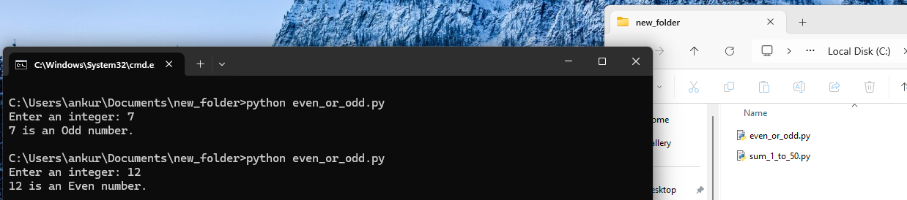
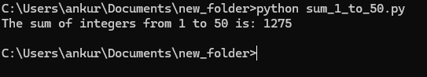

# Assignment 2: Module 3 - Control Structures in Python

## Task 1: Check if a Number is Even or Odd
- This Python program takes an integer input from the user and checks whether the number is even or odd using an if-else statement.

## Task 2: Sum of Integers from 1 to 50
- This Python program uses a for loop to calculate and display the sum of all integers from 1 to 50.
